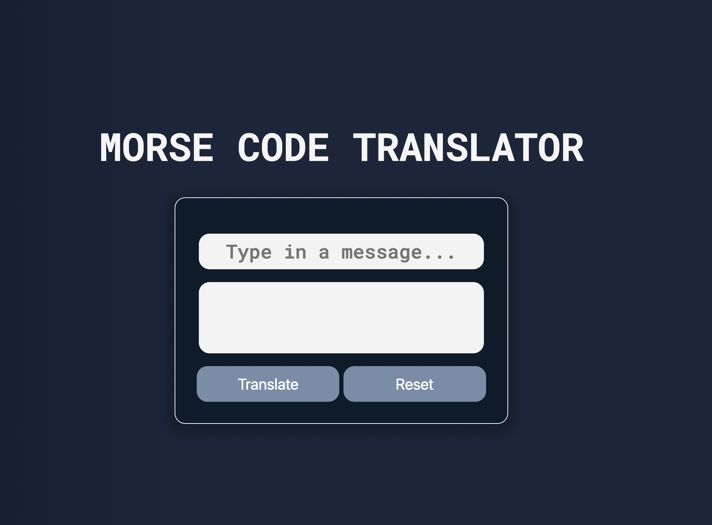

# morse-code-translator
## Author - Abdul Oketunde

## Overview 
This game was made during the 6th week of my _nology course. 
I used HTML SASS and vanilla Javascript. 

[Check out the Live Demo!](https://ab-96.github.io/morse-code-translator/)

## How it works
Type in any word of letter and click on translate to see some morse code!

